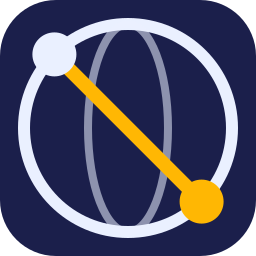
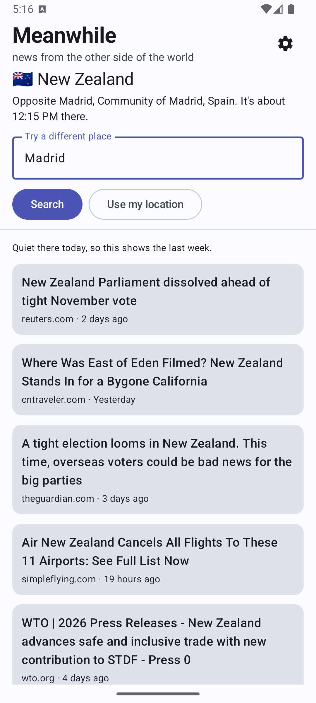
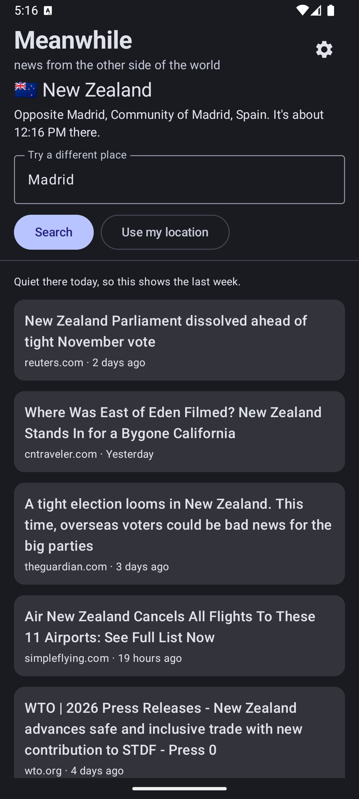
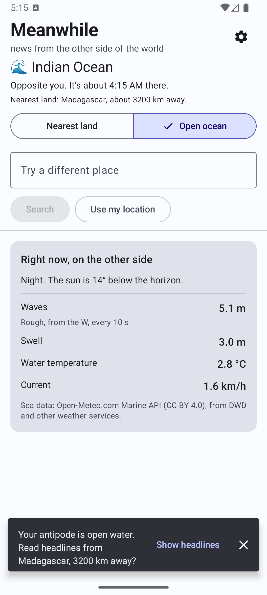
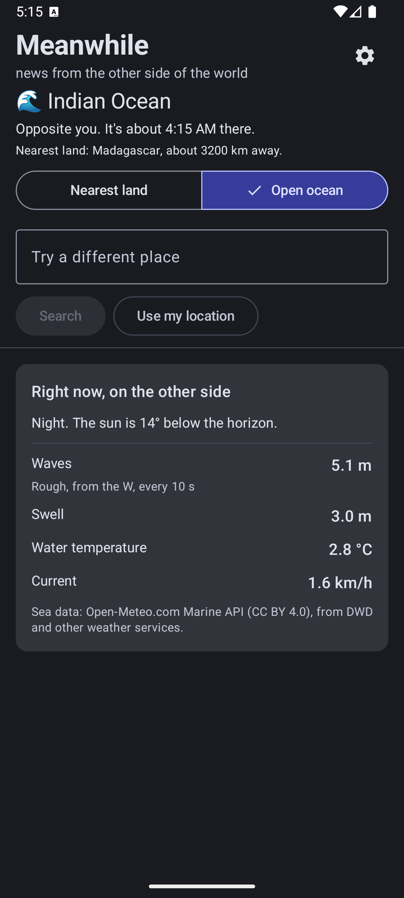

<p align="center">
  
</p>

# Meanwhile

News from the other side of the world.

Meanwhile finds the point exactly opposite you on Earth, your antipode, and shows what is happening there: headlines from that country. If the point is open water (and for most people it is), it opens on the sea itself instead, with live wave, swell, water temperature and current readings, and offers the headlines from the nearest land.

It is an Android app, a free hobby project with no ads and no account. It is not on Google Play yet.

<p align="center">
  
  
  
  
</p>

The first two are searched from Madrid (the opposite point is in New Zealand); the others are an antipode in open water.

## How it works

1. **Where you are.** Coarse location from Google Play services, or a place you search for. Nothing is stored and there is no account.
2. **Your antipode.** Latitude negated, longitude shifted by 180°. If it lands on land, that country is used. If it lands on water, the app searches in widening rings (25 km out to 8,000 km) for the nearest country that has coverage.
3. **Headlines.** Two sources run at once and results show as each one answers (typically a few seconds), not after the slowest one gives up:

   | Priority | Source | Used for |
   | --- | --- | --- |
   | 1 | [GDELT](https://www.gdeltproject.org) DOC API | Articles published in that country, last 24 hours, widening to 7 days if thin |
   | 2 | Curated outlet feeds (RSS) | Backup local outlets for the places people land on and GDELT answers badly or not at all: Madagascar, New Zealand, Australia, Peru, Argentina, Brazil, Japan and about 20 more, plus RNZ Pacific for small Pacific places (see [`docs/coverage`](docs/coverage/README.md)) |

   Results are merged in that order and de-duplicated by title. A lower-priority source is skipped if the higher ones already produced enough.
4. **Clean-up.** A domain blocklist, a language-fit rule (headlines in the wrong language for the country are dropped; this catches outlets GDELT files under the wrong place, such as a Taiwanese site tagged as Madagascar), and a noise filter (job ads and the like), then a cap per outlet so one site can't fill the list.
5. **Open ocean.** Sea state from the [Open-Meteo Marine API](https://open-meteo.com), plus the local time and whether it is day or night there (from the sun's altitude).
6. **Cache.** Recent headlines show immediately while fresh ones load; a two-minute cool-down avoids refetching when you rotate the phone or flip views; anything over three days old is ignored.

## Facts and numbers

| | |
| --- | --- |
| Package | `tt.co.jesses.meanwhile` |
| Platform | Android 8.0+ (minSdk 26), target and compile SDK 36 |
| Language and UI | Kotlin 2.3, Jetpack Compose with Material 3 |
| Architecture | MVI: `UiEvent` into `MainViewModel`, out comes an immutable `UiState` plus one-shot `UiEffect`s |
| Modules | `:core` (pure Kotlin/JVM: geometry, sources, cleanup, settings, telemetry vocabulary) and `:app` (Android UI) |
| Networking | Ktor client on OkHttp, kotlinx.serialization |
| Tests | Over 130 unit tests across `:core` and `:app`, no network needed (Ktor's mock engine and virtual time); a separate live check runs candidate feeds through the app's own parser |
| GDELT rate | One request per 5.5 s; after a 429 or a non-JSON reply it stands down for 1 to 15 minutes instead of retrying |
| Result limits | At most 100 headlines, 8 per outlet |
| Countries with explicit language rules | 11 (MG, TO, WS, NU, FM, TV, CC, LY, ME, AI, CO) |
| Dependencies | Open source licences are listed in the app (About, then Open source licenses) |

## Privacy

- Coarse location only, used to compute the opposite point. It is not stored.
- The last three places you pick from a search are kept on your phone so you can go back to them. They never leave it, and the Recent places list has a Clear button.
- Only the country code goes to the news sources. In ocean mode the opposite point's coordinates go to Open-Meteo.
- **Usage and crash reports are off by default.** If you opt in (Settings in the About screen), Firebase receives a fixed list of facts (screens opened, whether a load worked and how long it took, kinds of errors, phone model, app version) and never your location, antipode or searches. Turning it off clears the ID.
- No ads. Tapping a headline opens the publisher's own site.

The full text is in the app's About screen.

## Data and credits

- Headlines: the [GDELT Project](https://www.gdeltproject.org). Titles only, linked to the publishers.
- Sea conditions: [Open-Meteo.com](https://open-meteo.com) Marine API (data from DWD and other national weather services), used under [CC BY 4.0](https://creativecommons.org/licenses/by/4.0/) for non-commercial purposes. Not for navigation.
- Outlet feeds: Matangi Tonga and RNZ Pacific.

## Build

You need the Android SDK (set `sdk.dir` in `local.properties`) and a JDK.

```bash
./gradlew :core:test :app:testDebugUnitTest   # tests
./gradlew :app:assembleDebug                  # debug APK in app/build/outputs/apk/debug
```

Firebase is optional: put your own `google-services.json` in `app/` to enable it. Without the file the app builds and runs with reporting disabled.

## Support

A hobby project by [Jesse Scott](https://jesses.co.tt). If you'd like to support it, you can [buy me a coffee](https://ko-fi.com/jessescott).

## Licence

See [LICENSE](LICENSE).
